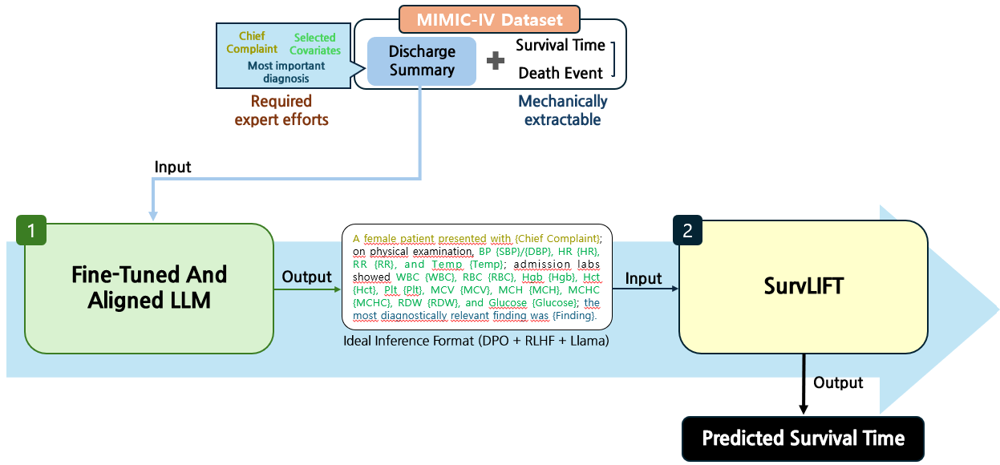

# 생존 분석을 위한 텍스트 언어 모델 사후 학습

* 경량 오픈소스 LLM인 [meta-llama/Llama-3.1-8B-Instruct](https://huggingface.co/meta-llama/Llama-3.1-8B-Instruct) 모델을 사후 학습하여, 장문의 퇴원요약지 텍스트에서 규격화된 핵심 분석들을 문장의 형태로 추출하는 파이프라인
* 기본적인 SFT + Alignment 프로세스와, [QLoRA](https://arxiv.org/abs/2305.14314), [Load to adapter twice](https://huggingface.co/docs/trl/v0.8.1/en/dpo_trainer#using-option-3---load-the-adapter-twice) 세팅을 사용

## Overview




## Setup

* 최대 처리 가능 토큰의 길이가 16,384일 때, 120GB 이상의 VRAM 및 128GB 이상의 시스템 메모리 권장. 입력되는 학습 데이터의 최대 토큰 시퀀스 길이를 더 길게 설정한다면, 이보다 많이 필요합니다.
* 학습 데이터셋에서 토큰 길이가 매우 긴 문장의 수가 적다면, Truncation 대신 해당 샘플을 제거하고 최대 컨텍스트를 줄이세요. 레이블이 있는 상황에서 Assistant Only Loss로 학습되므로, 해당 샘플이 학습에 주는 영향력은 없을 것입니다.
* cuda 12.8, Ubuntu 22.04에서 구동시켰으나, Ubuntu 24.04 이상을 권장합니다. Ubuntu 22.04 버전에서는 flash-attention 실행을 위한 다운그레이드 및 GLibc 업데이트가 필요할 수 있습니다. [참고: \[ISSUE\] GLIBC_2.32 not found](https://github.com/modular/modular/issues/3684#issuecomment-2480409734)
* Dependencies (아래를 순차적으로 설치)
   * `transformers bitsandbytes datasets sentencepiece accelerate trl peft wandb openai pqdm`: `pip install`로 일괄 설치
   * `pytorch`: [\[Pytorch\] Get Started](https://pytorch.org/get-started/locally/)
   * `flash-attention`: [\[GitHub\] flash-attention](https://github.com/Dao-AILab/flash-attention), [\[Wheels\]](https://github.com/Dao-AILab/flash-attention/discussions/1838)
   * `vllm`: [Installation > GPU](https://docs.vllm.ai/en/latest/getting_started/installation/gpu/)
* Docker Container 사용을 권장합니다.
  * 컨테이너 이미지 파일:
  
  ```{Dockerfile}
  # https://gitlab.com/nvidia/container-images/cuda/-/tree/master/dist 해당 링크에서 호스트 서버에 해당하는 cuda 버전과 ubuntu 버전을 확인할 수 있습니다.
  # 버전이 확인되었다면 cuda:00.0.0-cudnn-devel-ubuntu00.00으로 대신 입력하면 됩니다. 가능하면 호스트 서버와 동일한 cuda/ubuntu 버전으로 세팅해주세요.
  FROM nvidia/cuda:12.8.0-cudnn-devel-ubuntu22.04
  RUN apt-get update
  RUN apt-get install -y openssh-server
  RUN sed -i 's/#PermitRootLogin prohibit-password/PermitRootLogin yes/' /etc/ssh/sshd_config
  RUN ssh-keygen -A
  RUN mkdir -p /run/sshd
  RUN echo 'root:0000' | chpasswd
  
  CMD ["/usr/sbin/sshd", "-D"]
  ```

  * 이미지 빌드 및 도커 실행: 현재 디렉토리에 위의 이미지 파일이 `Dockerfile` 이름으로 저장되었을 때 순차적으로 실행

  ```{command}
  sudo docker build -t test-image -f Dockerfile .
  ```
  
  ```
  sudo docker run -itd \
	--name test-container \
	-p 8888:22 \
	--gpus all \
	--restart=unless-stopped \
	--shm-size=32g \
	--ipc=host \
	test-image
  ```

  > 빌드 시 `-t`에 `test-image`를 임의의 이름으로 바꿔서 설정하시면 되며, 도커 실행 시 `--name` 또한 임의로 지정할 수 있습니다.
  > 
  > `-p`: `컨테이너 포트(임의로 큰 수를 설정):호스트 포트(보통 22)`
  > 
  > `--restart`: PC 재시작 시 도커 자동 실행
  >
  > `--shm-size`: 공유 메모리 설정 (기본값으로 설정했을 때, 너무 작아 오류가 생길 수 있으므로 32g로 설정함)
  > 
  > `--ipc`: 공유 메모리 네임스페이스 (호스트에서 가져오기)


## [FSDP-QLoRA] Multi-GPU with QLoRA

* [Fully Sharded Data Parallel](https://huggingface.co/docs/peft/main/en/accelerate/fsdp#use-peft-qlora-and-fsdp-for-finetuning-large-models-on-multiple-gpus)
* [FSDP-QLoRA](https://huggingface.co/docs/bitsandbytes/main/fsdp_qlora)
* Multi-GPU 환경에서는 accelerator 모듈을 이용하여 분산 학습을 수행해야 합니다.
* 양자화 없이 학습하는 경우 FSDP를 아무런 문제 없이 바로 작동시킬 수 있습니다. 하지만 QLoRA의 경우 특정한 방법론을 적용하기 위해 코드를 약간 수정해야 합니다. 위 두 개 링크를 참고해주세요.
* 분산 환경에서 `SaveInferenceResultsCallback`이 정상적으로 동작하지 않음을 확인했습니다. 분산 학습 시 제외합니다.

## 기타 메모

* 훈련 데이터셋 규모가 너무 작음. 일반화에 어려움을 겪을 가능성 높음
* 적어도 수치값에 한정해서는 아예 없는 숫자를 지어내서 제시하지는 않는듯

## QLoRA Alignment 학습 시 유의사항

* 해당 링크에서 발췌: https://medium.com/@bnjmn_marie/dont-merge-your-lora-adapter-into-a-4-bit-llm-65b6da287997
* 병합 이후 다시 양자화하여 DPO adpater를 부착, 학습할 경우 SFT 모델이 왜곡됨. 따라서 모델을 병합하지 않고, SFT adapter를 DPO로 튜닝하는 것이 가장 효과적인 방법임.
* 최종 DPO를 마친 모델은 병합하여 추론하는 것이 바람직하나, 여러 시도를 해봤음에도 결과가 왜곡되었음. 직접 구현하면 방법이 있을지도... 참고 문서가 거의 없음.
* QLoRA로 학습 후 어뎁터와 병합할 경우, 결과가 뭉개짐. 아직 효과적인 QLoRA merge를 지원하는 공식적인 방법은 없?음.
* 추론 및 빌드는 어뎁터를 병합하지 않았더라도 vllm을 무조건 활용하세요. 처음 컴파일 하는데 시간이 많이 걸리긴 하지만, cpp 기반 + 유동 배치 활용이라는 점에서 몇백배는 더 빠른 퍼포먼스를 보여줍니다.
